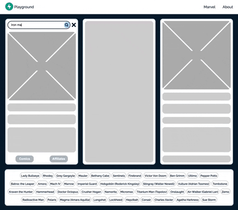

# fastapi-marvel
A small full stack webapp that leverages the Marvel Developer API to draw relationships between Characters and their Comics as well as their Affiliates.  All data is persisted and related so the more Affiliates you look up the more Characters you will discover!



## Technologies Used / Core Dependencies
* Frontend:
    
    - HTML / CSS
    - Javascript / AlpineJS

* Backend:

    - Python 3+ / FastApi / Uvicorn / aiohttp
    - Postgres / SqlAlchemy(ORM) / Alembic(Migrations) / psycopg2(db Driver)

## Getting Started
* First order of business is to install a version of Python 3 on your system.  I used Python 3.9 for the development of this project managed by pyenv.  Installation instructions for pyenv can be found in the README [HERE](https://github.com/pyenv/pyenv).
* You will also need API keys from Marvel to use their service.  It is free but you need to sign up [HERE](https://developer.marvel.com/).
* Next clone this repo to your system `git clone https://github.com/srh09/fastapi-marvel.git` and navigate to its root directory ie. `cd /Users/{name}/dev/fastapi-marvel`
* To keep your life in order I would suggest creating a Python virtual environment using the core library `python -m venv .venv` you should now see a .venv file at the root of your project
* `source .venv/bin/activate` to activate the .venv OR look into [DIRENV](https://direnv.net/ "direnv") to help manage venv and environment variables/secrets
* If you chose to use direnv and installed it to your system create a `.envrc` file in the root of your project and place the following commands:

    ```
    source .venv/bin/activate  # This activates your venv when you navigate to the root directory
    export POSTGRES_USER='postgres'
    export POSTGRES_PASSWORD='api-playground'
    export POSTGRES_SERVER='localhost'
    export POSTGRES_PORT='5432'
    export POSTGRES_DB='fast_db'
    export DATABASE_URL="postgresql://${POSTGRES_USER}:${POSTGRES_PASSWORD}@${POSTGRES_SERVER}:${POSTGRES_PORT}/${POSTGRES_DB}"
    export MARVEL_PUBLIC_KEY=''  # Put the API public key here
    export MARVEL_PRIVATE_KEY=''  # Put the API private key here
    ```
    - Every time you edit the .envrc file you will have to type `direnv allow` to leverage the new variables.  This is a security feature.
    - Note the database variable names, when you install postgres or any other relational db, sqlalchemy is going to use the above variables to connect to the database.

* Next you will have to install a database to your system, I used postgres, it is free and popular and I didn't want to be left out.  I would suggest downloading and following the instructions [HERE](https://www.postgresql.org/download/).

    - If you are using the variables above create a database called 'fast_db', the 'postgres' user is created by default.

* By this point all external dependencies have been addressed.  The rest can be handled by Poetry, the package manager.
* Run `pip install poetry` from the root directory of your project. To install the package manager to the venv.
* Next run `poetry install` to install all of the package dependencies specified in the pyproject.toml
* Congrats, the one time setup is complete.  Before executing the scripts from the next part go check out bin/run.sh in the project to see what is being executed.
* To avoid getting an error in the next step add a folder called 'versions' to fastapi-marvel/alembic path in your project.
* Run `bin/run.sh generate init` to generate an automated script that will populate the tables and columns of your database.
* Run `bin/run.sh migrate` to execute the automatically generated script that will populate the database.
* Run `bin/run.sh local` from the root of the project to start the webserver, then visit `http://localhost:8000/` in your browser (I use Chrome) to see the webapp running locally.
* That is it!  You now have an asynchronous webserver serving up static html/css/js to a client with a supporting database behind it to persist user data.  If I missed anything in this guide feel free to reach out.  Have fun!


## Contributing
If you have any suggestions/contributions/corrections to make feel free to make a PR.  Happy to hear suggestions.
